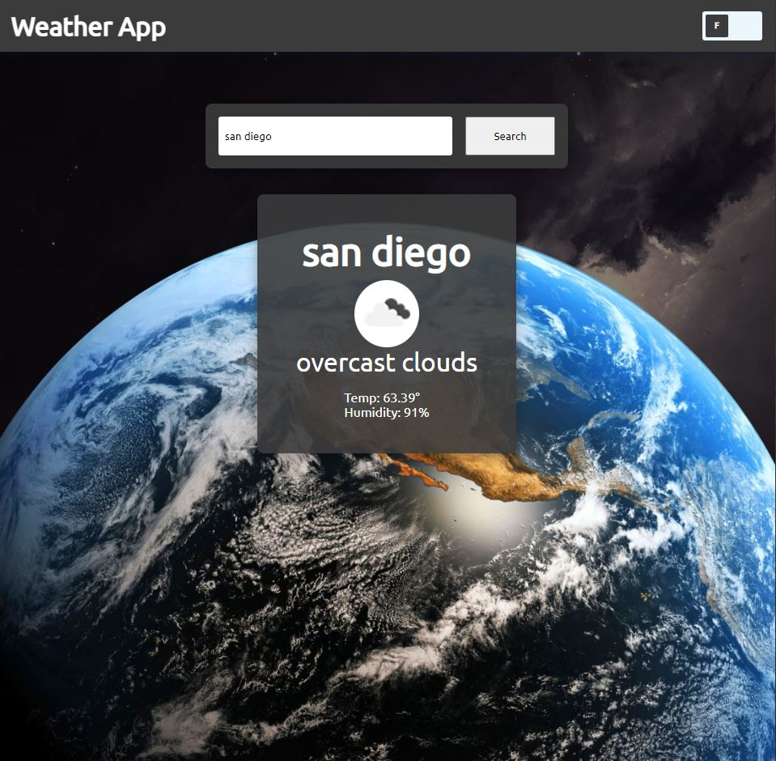

# TheOdinProject - Weather App

This is a solution to the [Weather App](https://www.theodinproject.com/lessons/node-path-javascript-weather-app).

## Table of contents

- [Overview](#overview)
  - [The challenge](#the-challenge)
  - [Screenshot](#screenshot)
  - [Links](#links)
- [My process](#my-process)
  - [Built with](#built-with)
  - [What I learned](#what-i-learned)
  - [Continued development](#continued-development)
  - [Useful resources](#useful-resources)
- [Author](#author)


## Overview

### The challenge

Users should be able to:

- Take API data and use the data to show on website while using the Async and Await method
- Be able to use try and catch method

### Screenshot




### Links

- Solution URL: [https://github.com/Kevo760/Weather-APP-TheOdinProject]
- Live Site URL: [https://weather-app-theodinproject.netlify.app/]

## My process

### Built with

- Semantic HTML5 markup
- CSS custom properties
- Flexbox
- Vanilla Javascript


### What I learned

I learned how to use the async and await methods while using the try and catch method with it. Below is the code that reflects that. I used the try method to
get the data first. It waits for the fetch to grab the data. Once the data is
grabbed it awaits it for convert it to json to allow the browser to read the data. Then I was the weather data to the weatherUI to obtain the icon, weather, temp, and humidity.


```js
async function getWeather(city, metric) {
    try {
    // Gets data from openweather
    const response = await fetch(`https://api.openweathermap.org/data/2.5/weather?q=${city}&appid=xxxx&units=${metric}`, {mode: 'cors'});
    // converts it to a readable file
    const weatherData = await response.json();
    // pushes data to weatherUI
    weatherUI(weatherData, city);
    } catch (error) {
    // Error message
      errorMessage();
    };

};

```


### Continued development

I would like to continue on working with async and await functions to get a
better understanding on how I can use this for bigger projects.


### Useful resources

- [Stackoverflow](https://www.stackoverflow.com) - This helped me go back on how to use the eventlisteners for the checkbox 'change' eventlistener.
- [TheOdinProject](https://www.theodinproject.com) - This allowed me to lead my way on the async and await methods by going back and reading the GIF project.


## Author

- Twitter - [@CodeKevo](https://www.twitter.com/CodeKevo)


